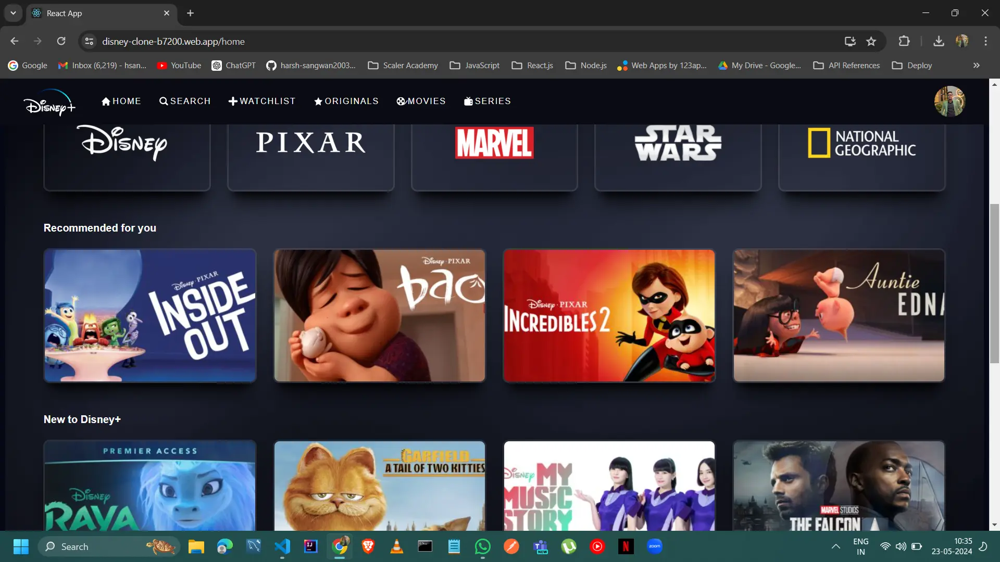

# Disney+ Clone

- Engineered Disney+ Clone website with React.js, Firebase, Styled Components, and Redux, achieving a faster loading speed and an impressive 0.01 CLS score.

## Live Demo

Check out the live demo of this app [here](https://disney-clone-b7200.web.app/).



## Description

- Engineered a full-stack web application with Firebase authentication, managing profiles & ensuring seamless streaming and enhanced user experience.
- Developed UI interfaces integrated with Firebase for secure user authentication and real-time database functionality, reducing load time by 40% with code-splitting and lazy-loading, and achieving a 0.01 CLS score.
- Implemented security measures against vulnerabilities like XSS, CSRF, and SQL injection.

## Technologies Used

- React JS
- Redux-Toolkit
- React-Redux
- React Router DOM
- Firebase
- Styled Components


### Clone and Run

1. Clone the repository:

```bash
git clone https://github.com/harsh-sangwan2003/100-days-web-dev/tree/main/ReactJS/Projects/disney-clone
```

2. Navigate to the project directory:

```bash
cd disney-clone
```

3. Install dependencies and start the development server:

```bash
npm install && start
```

4. Open your browser and navigate to http://localhost:3000 to view the app.

## Contributions

Contributions are welcome! Please fork the repository and submit a pull request with your changes.
